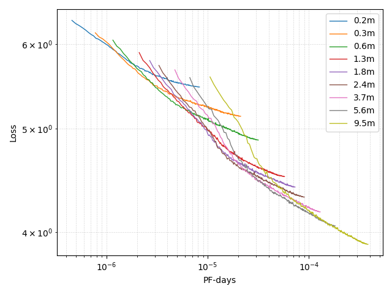
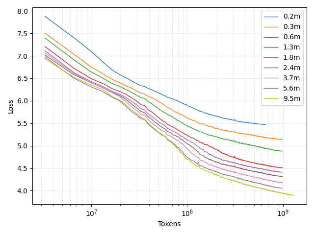

# Re-producing Transformer‐Scaling Laws on a Shoestring GPU

This repo recreates **Kaplan et al.**’s “optimal-compute” scaling law
>  *test loss L vs. non-embedding compute C (PF-days) with unlimited data*  

but **only uses sub-10 M-parameter GPT-2 mini-models trained for ~30 GPU-hours**.

[Kaplan, J., McCandlish, S., et al. (2020). Scaling Laws for Neural Language Models. arXiv:2001.08361](https://arxiv.org/abs/2001.08361).

---

## 1 Goal

* **Reproduce** the unlimited-data scaling law (Kaplan et al., 2020): L(C) ∝ C−0.050
* **Use tiny models** so the whole study fits in ≈ 30 GPU-hours.
* **Exercise the tooling** — HF Transformers (GPT2), streaming C4, flash-attention 2

---

## 2 Methods

| Element | Setting                                                                |
|---------|------------------------------------------------------------------------|
|Dataset | `allenai/c4` (streaming)                                               |
|Tokeniser | GPT-2 BPE, 50257 vocab                                                 |
|Context | 1024 tokens                                                            |
|Model sweep | dmodel ∈ {32…256}, nlayer=12, nhead=8 |
|Batch size | 32 sequences for all runs                                              |
|Optimiser | AdamW, LR = 1 e-3, no weight-decay                                     |
|Accelerator | 1× A100-40 GB, BF16, FlashAttention-2                                  |
|Time | 30 h total, 50 k – 150 k tokens s⁻¹ throughput                         |

<b>Non-embedding parameters per Transformer:</b>

Nnon-embed = nlayer &nbsp;(12&nbsp;dmodel2 + 13&nbsp;dmodel) + 2&nbsp;dmodel

<b>Non-embedding compute (FLOPs):</b>

<ul style="margin-left:2em">
  <li>
    per token: &nbsp;
    FLOPstoken = 2&nbsp;Nnon-embed + 2&nbsp;nlayer nctx dmodel
  </li>
  <li>
    per training step: &nbsp;
    FLOPsstep = B &nbsp;nctx &nbsp;FLOPstoken
    &nbsp; &nbsp; (where&nbsp;B = batch&nbsp;size)
  </li>
</ul>

---

## 3 Results

### 3.1 Loss vs. non-embedding compute

* Clear **two-regime kink**: fast initial drop, then slower power-law tail.
* Linear fit to the convex-hull segment (after the kink):

  L(C) = (C / 6.6×104)−0.0717

Kaplan’s efficient-frontier fit (Figure 1): L(C) = (C / 2.3×108)−0.050

### 3.2 Loss vs. tokens processed

* Small models learn **slower at every stage**; they are compute-inefficient.
* Identical batch size highlights that width alone drives the differences.
* Compare to Figure 2 in Kaplan et al.

---

## 4 Discussion & comparison to the original paper

* **Same batch size** for every run ⇒ we plot *raw* compute, not the batch-corrected \(Cmin
  \). That explains the steeper exponent (-0.0717 vs -0.050).
* **Width sweep only** (layers held at 12), so architectural degrees of freedom differ from Kaplan et al.’s joint width/depth scaling.
* Absolute loss is lower (≈ 3.8 – 6.3) due to tokenizer and vocabulary differences; the slope comparison is what matters.

---

## 6 Reproduce / extend

1. `git clone https://github.com/davidmoser/scaling_laws.git && cd scaling_laws`
2. `pip install -r requirements.txt`
3. Set `HF_TOKEN` with access to *allenai/c4*, `cd src`
4. `python -m train_model.py` — expect ≈ 30 GPU-hours on one A100.
5. `python -m plot_loss_vs_compute.py` — generate compute plot & fit print-out.
6. `python -m plot_loss_vs_tokens.py` — generate token plots

Feel free to fork, swap schedulers, vary batch size, or push to larger d-models to see how the exponent bends toward the canonical −0.05 line.